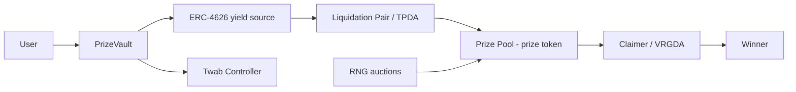

# 02 — PoolTogether research (cleartext baseline)

Primary sources fetched:

- [What Is PoolTogether?](https://dev.pooltogether.com/protocol/introduction)
- [V5 Protocol Design](https://dev.pooltogether.com/protocol/design/)
- Related: [Prize Vault](https://dev.pooltogether.com/protocol/reference/prize-vault/), [Twab Controller](https://dev.pooltogether.com/protocol/reference/twab-controller/), [Draw Auction](https://dev.pooltogether.com/protocol/design/draw-auction), [Bots](https://dev.pooltogether.com/protocol/guides/bots/)
- Client: [@generationsoftware/hyperstructure-react-hooks](https://www.npmjs.com/package/@generationsoftware/hyperstructure-react-hooks) · [pooltogether-client-monorepo](https://github.com/GenerationSoftware/pooltogether-client-monorepo)

Saved narrative excerpts: `research/pooltogether/`.

---

## One-liner

Users deposit into a yield-bearing vault; **yield** (not principal) is awarded randomly as prizes; users can withdraw principal anytime — **no-loss prize savings**.

---

## User experience (product loop)

1. Deposit tokens  
2. Yield accrues  
3. Yield is randomly awarded as prizes  
4. Withdraw deposit anytime  

Design principles (V5): **autonomous**, **permissionless**, **incentivized** maintenance (bots).

---

## V5 architecture (simplified)

### Deposits

- Users deposit into an **ERC-4626 Prize Vault** (factory-deployable).
- Vault contributes yield to the **Prize Pool** and tracks balances via **Twab Controller**.
- Default vault often **does not store balances internally** — balances live in TWAB.
- TWAB = **time-weighted average balance** so eligibility uses average liquidity over a window, not just spot balance.

### Liquidation

- Vault yield is auctioned (TPDA) for the **prize token** (e.g. WETH on some deployments).
- Prize token lands in the **Prize Pool**; vault contribution is recorded.
- One shared prize liquidity pool per chain (not cross-chain).

### Draws

- Periodic **Draws** with lifecycle: Open → Closed → Awarded → Finalized.
- Prize liquidity split across **tiers** + **reserve** (adaptive tier count via “canary” tiers).
- RNG historically via **auctioned** external RNG (Chainlink / Witnet-style), not FHE.

### Winner eligibility (cleartext math)

For a user / vault / tier / prize index:

1. Build a **pseudo-random number** from draw RNG + ids (keccak of encoded params).  
2. Compute **winning zone** ≈ `tierOdds * userTwab * vaultPortion`.  
3. User wins if squeezed PRN falls in that zone relative to vault supply.

So odds scale with **how much** you held **over time** (TWAB) and vault contribution share.

### Claiming

- Vaults claim on behalf of users; default **VRGDA claimer** incentivizes bots to claim for winners.
- V5 marketing also emphasizes automated prize delivery UX in some deployments — still underpinned by claim paths.

---

## What frontend hooks care about

From `@generationsoftware/hyperstructure-react-hooks` (v1.28.x at fetch time):

- **Vault**: deposit/redeem/withdraw txs, balances, exchange rates, yield source  
- **Prize pool**: draw ids/periods, prize odds, winners, prize token  
- **Events**: deposits, withdraws, draw awarded/started/finished  
- Built on **wagmi + viem + react-query + jotai**

Useful as a **UX / data-model reference**, not as a drop-in for confidential balances (those hooks assume public ERC-20/4626 state).

---

## What we must keep vs what we can simplify for the bounty

| PoolTogether V5 piece | Needed for bounty? | Notes |
|----------------------|--------------------|-------|
| No-loss principal | **Yes** | Explicit requirement |
| Deposit-weighted odds | **Yes** | Over **encrypted** balances |
| Onchain randomness | **Yes** | Must be **FHE** (`FHE.randEuint`), not Chainlink VRF |
| Shared prize from yield | **Yes** (mock OK) | Admin-funded reserve is fine if documented |
| TWAB over long windows | Optional | Hard under FHE; spot encrypted balance may be acceptable if documented |
| Multi-tier / canary / VRGDA | Optional | Nice UX later; not required for correctness |
| Liquidation auctions | Optional | Mock yield skips this |
| Permissionless vault factory | Optional | Single vault is enough for demo |

---

## Transparency problem (why Zama)

Public PoolTogether reveals:

- Every user’s deposit / TWAB → **wealth + odds**  
- Who won which draw → **targeting / privacy loss**  

Confidential version must hide deposit sizes and ideally sensitive odds/outcome details while remaining **provably fair**.
